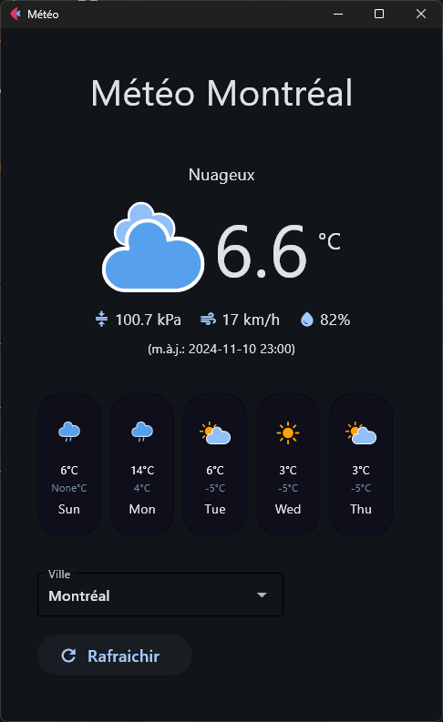

# flet-demo-meteo

Cette application météo est un exemple d'utilisation du framework Flet pour créer des applications (web et natives) rapidement en Python.

Pour en apprendre plus sur Flet, consultez la documentation (https://flet.dev/docs/) qui contient plusieurs exemples d'utilisations des différentes composantes d'interface


## Exécution

### Prérequis
* [Python 3](https://www.python.org/downloads/)
* (optionel) [git](https://git-scm.com/downloads) 
* (optionel) module de [virtual environment](https://packaging.python.org/en/latest/guides/installing-using-pip-and-virtual-environments/)
* Les modules dans le fichier requirements.txt
  * flet version 0.24.*
  * env-canada


Pour exécuter le script
```
> git clone https://github.com/muskeg/flet-demo-meteo.git
> cd  .\flet-demo-meteo\
flet-demo-meteo> python -m venv .venv
flet-demo-meteo> .\.venv\Scripts\activate
flet-demo-meteo> pip install -r .\requirements.txt
flet-demo-meteo> flet run
```
Si tout se passe comme prévu, l'application se lance:



## Code

### Diagrammes
Consultez les diagrammes de classes et de séquences ici:
* classes: [diagrammes/classes.md](https://github.com/muskeg/flet-demo-meteo/blob/main/diagrammes/classes.md)
* séquences: [diagrammes/sequences.md](https://github.com/muskeg/flet-demo-meteo/blob/main/diagrammes/sequences.md)

### main.py

Ce fichier est le point d'entrée principal de l'application. Il utilise le framework Flet pour créer une application web simple qui affiche les prévisions météorologiques d'Environnement Canada pour une station météo donnée. La classe principale `TemperatureVille` gère l'affichage du layout et les interactions utilisateur, comme le changement de ville et le rafraîchissement des données météorologiques.

Fonctions principales :
- `affiche_layout()`: Affiche le layout de l'application.
- `drop_change(event)`: Gère le changement de la ville sélectionnée dans le dropdown.
- `clic_bouton(_)`: Gère le clic sur le bouton de rafraîchissement.

### meteo/conditions.py

Ce module contient la classe `Conditions` qui permet de récupérer et de mettre à jour les conditions météorologiques actuelles d'une station météo donnée en utilisant l'API d'Environnement Canada.

Fonctions principales :
- `maj()`: Met à jour les conditions actuelles.
- `temp_actuelle()`: Retourne la température actuelle.
- `condition_actuelle()`: Retourne la condition météorologique actuelle.
- `icone_actuelle()`: Retourne l'icône correspondant à la condition actuelle.
- `humidite_actuelle()`: Retourne l'humidité actuelle.
- `pression_actuelle()`: Retourne la pression actuelle.
- `vent_actuel()`: Retourne la vitesse du vent actuelle.
- `temps_observation()`: Retourne le temps de l'observation.

### meteo/previsions.py

Ce module contient la classe `Previsions` qui permet de récupérer les prévisions météorologiques d'une station météo donnée en utilisant l'API d'Environnement Canada.

Fonctions principales :
- `maj()`: Met à jour les prévisions météorologiques.
- `previsions()`: Retourne les prévisions horaires.
- `previsions_jour()`: Retourne les prévisions journalières.
- `prevision_5_jours()`: Retourne les prévisions pour les 5 prochains jours.
- `prevision_un_jour(date)`: Retourne les prévisions pour une journée précise.

### meteo/vues.py

Ce module contient les classes de vues pour l'application météo. Ces classes sont utilisées pour afficher les conditions actuelles et les prévisions météorologiques.

Classes principales :
- `VueConditionsActuelles`: Vue des conditions météorologiques actuelles.
- `JourPrevision`: Vue d'une prévision météorologique pour une journée.
- `VuePrevisions`: Vue des prévisions météorologiques.

### meteo/icones.py

Ce module contient la classe `Icones` qui définit les icônes utilisées pour les conditions climatiques. Les icônes sont définies sous forme d'énumération (`Enum`), chaque icône correspondant à une condition météorologique spécifique.

## Attributions

* L'application utilise le module [env_canda](https://github.com/michaeldavie/env_canada) pour faciliter récuperer les données météorologiques
* Les icônes de conditions climatiques proviennent d'un [ensemble d'icônes](https://github.com/Makin-Things/weather-icons) destiné à une utilisation à l'intérieur de [Home Assistant](https://www.home-assistant.io/)

