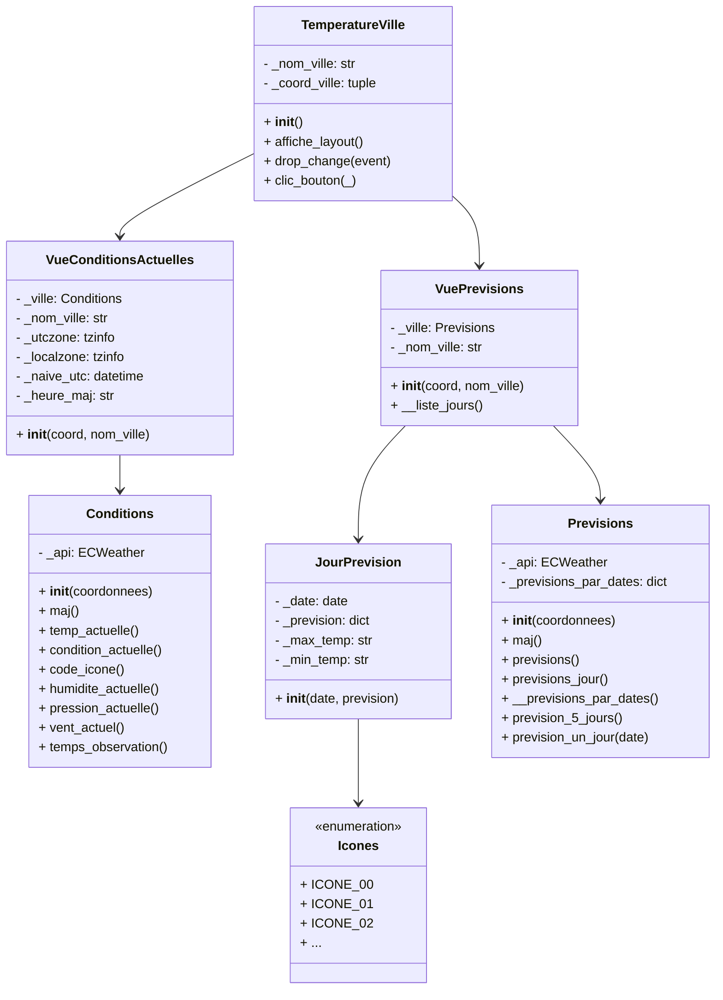

# Diagrammes de classes

```mermaid
classDiagram
    class TemperatureVille {
        - _nom_ville: str
        - _coord_ville: tuple
        + __init__()
        + affiche_layout()
        + drop_change(event)
        + clic_bouton(_)
    }

    class VueConditionsActuelles {
        - _ville: Conditions
        - _nom_ville: str
        - _utczone: tzinfo
        - _localzone: tzinfo
        - _naive_utc: datetime
        - _heure_maj: str
        + __init__(coord, nom_ville)
    }

    class JourPrevision {
        - _date: date
        - _prevision: dict
        - _max_temp: str
        - _min_temp: str
        + __init__(date, prevision)
    }

    class VuePrevisions {
        - _ville: Previsions
        - _nom_ville: str
        + __init__(coord, nom_ville)
        + __liste_jours()
    }

    class Conditions {
        - _api: ECWeather
        + __init__(coordonnees)
        + maj()
        + temp_actuelle()
        + condition_actuelle()
        + code_icone()
        + humidite_actuelle()
        + pression_actuelle()
        + vent_actuel()
        + temps_observation()
    }

    class Previsions {
        - _api: ECWeather
        - _previsions_par_dates: dict
        + __init__(coordonnees)
        + maj()
        + previsions()
        + previsions_jour()
        + __previsions_par_dates()
        + prevision_5_jours()
        + prevision_un_jour(date)
    }

    class Icones {
        <<enumeration>>
        + ICONE_00
        + ICONE_01
        + ICONE_02
        + ...
    }

    TemperatureVille --> VueConditionsActuelles
    TemperatureVille --> VuePrevisions
    VueConditionsActuelles --> Conditions
    VuePrevisions --> JourPrevision
    VuePrevisions --> Previsions
    JourPrevision --> Icones
```