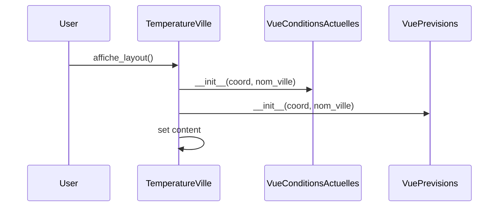
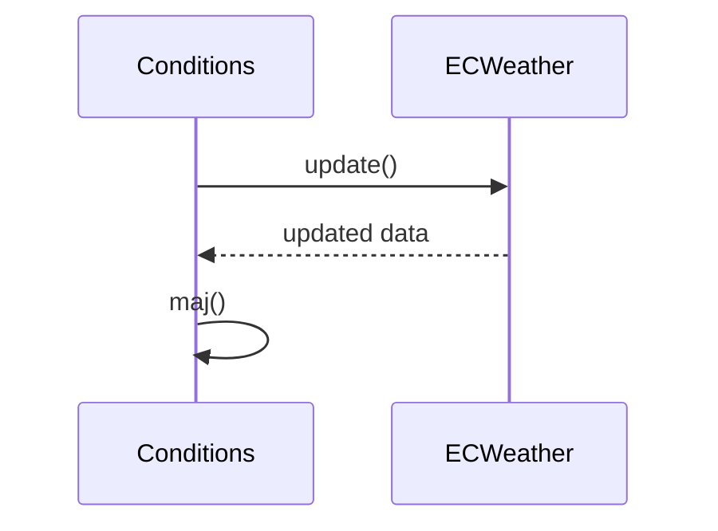
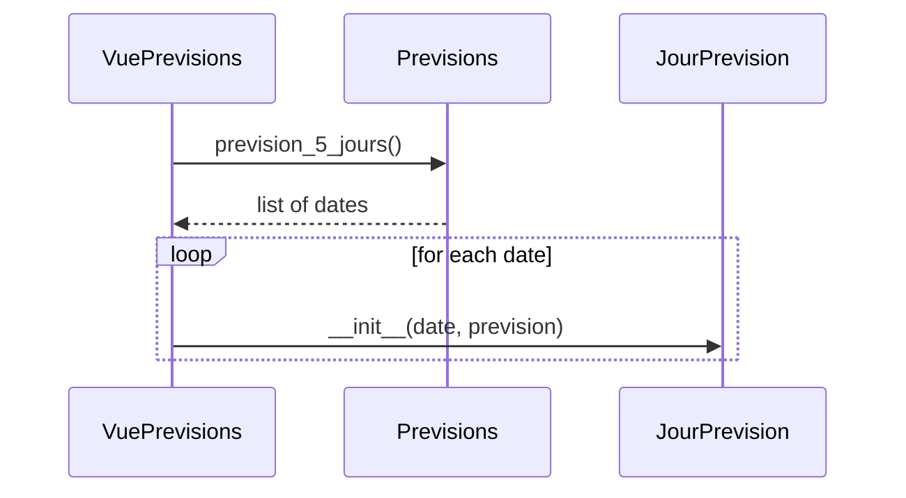

# Diagrammes de séquences

## Afficher le layout

```mermaid
sequenceDiagram
    participant User
    participant TemperatureVille
    participant VueConditionsActuelles
    participant VuePrevisions

    User ->> TemperatureVille: affiche_layout()
    TemperatureVille ->> VueConditionsActuelles: __init__(coord, nom_ville)
    TemperatureVille ->> VuePrevisions: __init__(coord, nom_ville)
    TemperatureVille ->> TemperatureVille: set content
```

## Mettre à jour les conditions météo

```mermaid
sequenceDiagram
    participant Conditions
    participant ECWeather

    Conditions ->> ECWeather: update()
    ECWeather -->> Conditions: updated data
    Conditions ->> Conditions: maj()
```

## Lister les jours des prévisions

```mermaid
sequenceDiagram
    participant VuePrevisions
    participant Previsions
    participant JourPrevision

    VuePrevisions ->> Previsions: prevision_5_jours()
    Previsions -->> VuePrevisions: list of dates
    loop for each date
        VuePrevisions ->> JourPrevision: __init__(date, prevision)
    end
```